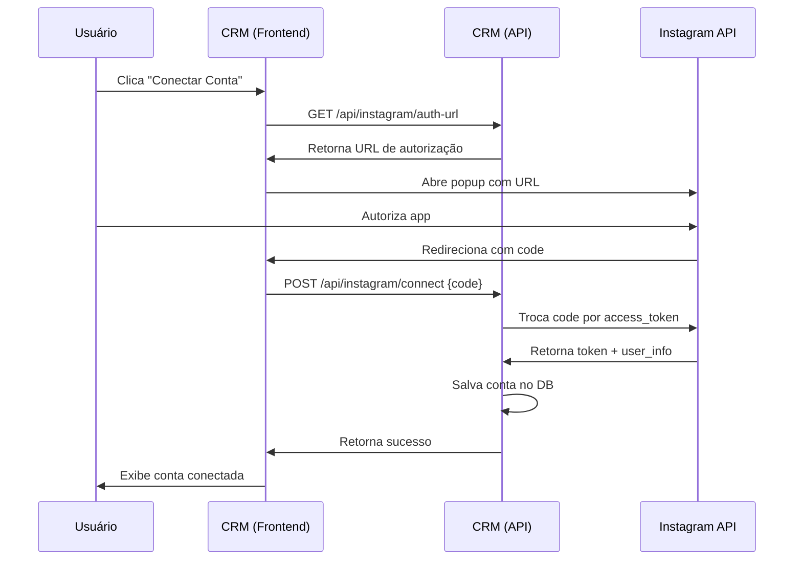

# Integração Instagram - Guia Completo

## 📋 Visão Geral

Sistema completo para conectar contas do Instagram Business via OAuth 2.0 e exibir posts em sites externos através de uma API pública.

### ✅ Funcionalidades Implementadas

- ✅ Autenticação OAuth 2.0 oficial do Instagram
- ✅ Gerenciamento de múltiplas contas por empresa
- ✅ Buscar posts recentes (imagens, vídeos, carrosséis)
- ✅ API pública para sites externos
- ✅ Atualização automática de tokens
- ✅ Interface Inertia.js para gerenciamento

---

## 🔧 Configuração Inicial

### 1. Criar App do Instagram/Facebook

1. Acesse: https://developers.facebook.com/apps
2. Crie um novo app (tipo "Business")
3. Adicione o produto **Instagram Basic Display**
4. Configure OAuth Redirect URI: `https://seu-dominio.com/instagram`

### 2. Configurar `.env`

```env
# Instagram API Credentials
INSTAGRAM_CLIENT_ID=seu_client_id
INSTAGRAM_CLIENT_SECRET=seu_client_secret
INSTAGRAM_REDIRECT_URI=https://seu-dominio.com/instagram
```

### 3. Atualizar `config/services.php`

```php
'instagram' => [
    'client_id' => env('INSTAGRAM_CLIENT_ID'),
    'client_secret' => env('INSTAGRAM_CLIENT_SECRET'),
    'redirect_uri' => env('INSTAGRAM_REDIRECT_URI'),
],
```

---

## 🚀 Como Usar (Usuário do CRM)

### Conectar Conta do Instagram

1. Acesse: `/instagram` no CRM
2. Clique em **"Conectar Conta"**
3. Popup do Instagram abrirá
4. Faça login e autorize o app
5. Conta será conectada automaticamente

### Ver Posts Recentes

- Na página `/instagram`, selecione uma conta para visualizar os posts
- Posts são exibidos em grid com thumbnails
- Informações: curtidas, comentários, data

### Atualizar Token

- Clique em **"Atualizar Token"** na conta
- Token é renovado por mais 60 dias

### Desconectar Conta

- Clique em **"Desconectar"** na conta
- Confirme a ação

---

## 🌐 API Pública (Para Sites Externos)

### Autenticação

Use a `site_key` do CMS:
- Header: `X-Site-Key: sua-chave-aqui`
- Query param: `?site_key=sua-chave-aqui`

### Endpoints

#### 1. Buscar Posts do Instagram

```http
GET /api/public/instagram/posts
```

**Parâmetros:**
- `site_key` (obrigatório): API key do site
- `username` (opcional): Username específico
- `limit` (opcional): Quantidade de posts (padrão: 12, máx: 50)

**Exemplo:**

```javascript
fetch('https://seu-crm.com/api/public/instagram/posts?site_key=abc123&limit=12')
  .then(res => res.json())
  .then(data => {
    console.log(data.posts); // Array de posts
  });
```

**Resposta:**

```json
{
  "success": true,
  "posts": [
    {
      "id": "123456789",
      "username": "sua_conta",
      "caption": "Legenda do post...",
      "media_type": "IMAGE",
      "media_url": "https://...",
      "thumbnail_url": "https://...",
      "permalink": "https://instagram.com/p/...",
      "timestamp": "2026-02-14T10:30:00Z",
      "like_count": 250,
      "comments_count": 30,
      "children": null
    }
  ],
  "count": 12,
  "accounts": ["sua_conta"]
}
```

#### 2. Listar Contas Conectadas

```http
GET /api/public/instagram/accounts
```

**Exemplo:**

```javascript
fetch('https://seu-crm.com/api/public/instagram/accounts?site_key=abc123')
  .then(res => res.json())
  .then(data => {
    console.log(data.accounts);
  });
```

---

## 🎨 Exemplo: Carrossel JavaScript

### HTML

```html
<div id="instagram-carousel" class="instagram-carousel"></div>
```

### CSS

```css
.instagram-carousel {
  display: grid;
  grid-template-columns: repeat(auto-fill, minmax(300px, 1fr));
  gap: 1rem;
  padding: 2rem;
}

.instagram-post {
  border: 1px solid #e0e0e0;
  border-radius: 8px;
  overflow: hidden;
  transition: transform 0.2s;
}

.instagram-post:hover {
  transform: translateY(-4px);
  box-shadow: 0 4px 12px rgba(0,0,0,0.1);
}

.instagram-post img {
  width: 100%;
  height: 300px;
  object-fit: cover;
}

.instagram-post-info {
  padding: 1rem;
}

.instagram-post-caption {
  font-size: 14px;
  color: #333;
  margin-bottom: 0.5rem;
}

.instagram-post-stats {
  display: flex;
  gap: 1rem;
  font-size: 12px;
  color: #666;
}
```

### JavaScript

```javascript
async function loadInstagramPosts() {
  const SITE_KEY = 'sua-chave-aqui';
  const API_URL = 'https://seu-crm.com/api/public/instagram/posts';
  
  try {
    const response = await fetch(`${API_URL}?site_key=${SITE_KEY}&limit=12`);
    const data = await response.json();
    
    if (!data.success) {
      console.error('Erro ao carregar posts do Instagram');
      return;
    }
    
    const container = document.getElementById('instagram-carousel');
    container.innerHTML = '';
    
    data.posts.forEach(post => {
      const postElement = createPostElement(post);
      container.appendChild(postElement);
    });
  } catch (error) {
    console.error('Erro:', error);
  }
}

function createPostElement(post) {
  const div = document.createElement('div');
  div.className = 'instagram-post';
  
  const mediaUrl = post.media_type === 'VIDEO' 
    ? post.thumbnail_url 
    : post.media_url;
  
  const caption = post.caption 
    ? post.caption.substring(0, 100) + '...' 
    : '';
  
  div.innerHTML = `
    <a href="${post.permalink}" target="_blank" rel="noopener">
      
    </a>
    <div class="instagram-post-info">
      <p class="instagram-post-caption">${caption}</p>
      <div class="instagram-post-stats">
        <span>❤️ ${post.like_count}</span>
        <span>💬 ${post.comments_count}</span>
      </div>
    </div>
  `;
  
  return div;
}

// Carregar posts ao iniciar
loadInstagramPosts();

// Atualizar a cada 5 minutos
setInterval(loadInstagramPosts, 5 * 60 * 1000);
```

---

## 📱 Tipos de Mídia Suportados

| Tipo | Descrição | URL Principal |
|------|-----------|---------------|
| `IMAGE` | Foto única | `media_url` |
| `VIDEO` | Vídeo | `media_url` (+ `thumbnail_url`) |
| `CAROUSEL_ALBUM` | Múltiplas fotos/vídeos | `children.data[].media_url` |

---

## 🔒 Segurança

### Rate Limiting

- API pública: 60 requisições/minuto por IP
- API privada: Autenticação Sanctum obrigatória

### Validações

- `site_key` validado no banco de dados
- Apenas sites ativos podem buscar dados
- Tokens do Instagram criptografados no banco

---

## 🐛 Troubleshooting

### "API Key não fornecida"

✅ Verifique se está enviando `site_key` no header ou query param

### "Site não encontrado ou inativo"

✅ Verifique se o site está ativo no CRM
✅ Confirme a chave API correta

### "Nenhuma conta do Instagram conectada"

✅ Conecte uma conta em `/instagram`
✅ Verifique se a conta está ativa

### Token expirado

✅ Clique em "Atualizar Token" no CRM
✅ Tokens expiram após 60 dias

---

## 📊 Estrutura do Banco de Dados

### `instagram_accounts`

```sql
- id
- company_id (FK para companies)
- instagram_user_id (único)
- username
- access_token (criptografado)
- token_expires_at
- account_type (BUSINESS, CREATOR, PERSONAL)
- profile_picture_url
- followers_count
- is_active
- metadata (JSON)
- timestamps
- soft_deletes
```

---

## 🔄 Fluxo OAuth 2.0



---

## 🧪 Testes

### Testar Conexão OAuth

```bash
# 1. Abrir no navegador
https://seu-crm.com/instagram

# 2. Clicar em "Conectar Conta"
# 3. Autorizar no Instagram
# 4. Verificar se conta aparece na lista
```

### Testar API Pública

```bash
curl -X GET "https://seu-crm.com/api/public/instagram/posts?site_key=SUA_CHAVE&limit=5" \
  -H "Accept: application/json"
```

---

## 📝 TODO Futuro

- [ ] Webhook para mensagens em tempo real
- [ ] Responder mensagens diretas
- [ ] Buscar comentários dos posts
- [ ] Analytics de posts (insights)
- [ ] Agendar posts (requer permissões extras)

---

## 🆘 Suporte

- **Documentação Meta:** https://developers.facebook.com/docs/instagram-api
- **Permissões necessárias:** `instagram_basic`, `instagram_manage_messages`
- **Tipo de conta:** Instagram Business ou Creator

---

**Implementado em:** 14 de fevereiro de 2026
**Versão:** 1.0
