# Pipeline Kanban - Arquitetura e Fluxos

## 📐 Diagrama de Arquitetura


## 🔄 Fluxo de Movimentação de Lead

```mermaid
sequenceDiagram
    participant User
    participant Board as Kanban Board
    participant API as LeadMovementController
    participant Service as LeadMovementService
    participant DB as Database
    participant Event as Event System
    participant Notify as Notifications

    User->>Board: Arrasta Lead para novo estágio
    Board->>Board: Validação local
    Board->>API: POST /leads/{id}/move
    API->>Service: moveLead(leadId, stageId, userId)
    
    Service->>DB: Buscar lead e estágios
    DB-->>Service: Lead e Stage data
    
    Service->>Service: Validar movimentação
    Service->>Service: Calcular tempo no estágio anterior
    
    Service->>DB: Criar LeadStageHistory
    Service->>DB: Atualizar lead_pipeline
    Service->>DB: Atribuir responsável (se necessário)
    
    Service->>Event: Disparar LeadMovedEvent
    Event->>Notify: Notificar responsável
    Event->>Notify: Atualizar métricas
    
    Service-->>API: Sucesso + dados atualizados
    API-->>Board: Response 200 + lead atualizado
    Board->>Board: Atualizar UI
    Board->>User: Feedback visual
```



## 🏗️ Estrutura de Dados

### Tabela: lead_pipeline (Pivot)
```sql
CREATE TABLE lead_pipeline (
    id BIGINT PRIMARY KEY,
    lead_id BIGINT NOT NULL,
    pipeline_stage_id BIGINT NOT NULL,
    position INT DEFAULT 0,
    moved_by BIGINT NULL,           -- Novo: quem moveu
    moved_at TIMESTAMP NULL,         -- Novo: quando moveu
    entered_at TIMESTAMP NULL,       -- Novo: quando entrou no estágio
    created_at TIMESTAMP,
    updated_at TIMESTAMP,
    
    FOREIGN KEY (lead_id) REFERENCES leads(id),
    FOREIGN KEY (pipeline_stage_id) REFERENCES pipeline_stages(id),
    FOREIGN KEY (moved_by) REFERENCES users(id)
);
```

### Tabela: lead_stage_history (Nova)
```sql
CREATE TABLE lead_stage_history (
    id BIGINT PRIMARY KEY,
    lead_id BIGINT NOT NULL,
    pipeline_id BIGINT NOT NULL,
    from_stage_id BIGINT NULL,
    to_stage_id BIGINT NOT NULL,
    moved_by BIGINT NOT NULL,
    moved_at TIMESTAMP NOT NULL,
    duration_in_previous_stage INT NULL, -- em segundos
    notes TEXT NULL,
    
    FOREIGN KEY (lead_id) REFERENCES leads(id),
    FOREIGN KEY (pipeline_id) REFERENCES pipelines(id),
    FOREIGN KEY (from_stage_id) REFERENCES pipeline_stages(id),
    FOREIGN KEY (to_stage_id) REFERENCES pipeline_stages(id),
    FOREIGN KEY (moved_by) REFERENCES users(id)
);
```

## 📊 Modelo de Dados Relacional

```mermaid
erDiagram
    LEADS ||--o{ LEAD_PIPELINE : "está em"
    PIPELINE_STAGES ||--o{ LEAD_PIPELINE : "contém"
    USERS ||--o{ LEAD_PIPELINE : "moveu"
    
    LEADS ||--o{ LEAD_STAGE_HISTORY : "tem histórico"
    PIPELINES ||--o{ LEAD_STAGE_HISTORY : "registra"
    PIPELINE_STAGES ||--o{ LEAD_STAGE_HISTORY : "origem/destino"
    USERS ||--o{ LEAD_STAGE_HISTORY : "executou"
    
    PIPELINES ||--o{ PIPELINE_STAGES : "possui"
    COMPANIES ||--o{ PIPELINES : "gerencia"
    COMPANIES ||--o{ LEADS : "possui"

    LEADS {
        bigint id PK
        bigint company_id FK
        bigint assigned_to FK
        string name
        string email
        string status
        timestamp created_at
    }
    
    PIPELINE_STAGES {
        bigint id PK
        bigint pipeline_id FK
        string name
        int order
        int probability
        string color
    }
    
    LEAD_PIPELINE {
        bigint id PK
        bigint lead_id FK
        bigint pipeline_stage_id FK
        int position
        bigint moved_by FK
        timestamp moved_at
        timestamp entered_at
    }
    
    LEAD_STAGE_HISTORY {
        bigint id PK
        bigint lead_id FK
        bigint pipeline_id FK
        bigint from_stage_id FK
        bigint to_stage_id FK
        bigint moved_by FK
        timestamp moved_at
        int duration_in_previous_stage
        text notes
    }
```



## 🎨 Componentes Vue - Hierarquia


## 🔐 Fluxo de Permissões

```mermaid
flowchart TD
    Start([Usuário tenta mover lead]) --> CheckAuth{Autenticado?}
    CheckAuth -->|Não| Deny[Negar acesso]
    CheckAuth -->|Sim| CheckCompany{Lead da mesma<br/>empresa?}
    
    CheckCompany -->|Não| Deny
    CheckCompany -->|Sim| CheckStage{Estágio válido<br/>para pipeline?}
    
    CheckStage -->|Não| Deny
    CheckStage -->|Sim| CheckPolicy{Policy<br/>canMoveLead?}
    
    CheckPolicy -->|Não| Deny
    CheckPolicy -->|Sim| CheckSameStage{Mesmo estágio?}
    
    CheckSameStage -->|Sim| Warn[Avisar usuário]
    CheckSameStage -->|Não| CheckBackward{Retrocedendo?}
    
    CheckBackward -->|Sim| Confirm{Confirmar?}
    Confirm -->|Não| Cancel[Cancelar]
    Confirm -->|Sim| Move
    
    CheckBackward -->|Não| Move[Executar movimentação]
    Move --> Log[Registrar histórico]
    Log --> Notify[Notificar]
    Notify --> Success([Sucesso])
    
    style Start fill:#3b82f6
    style Success fill:#10b981
    style Deny fill:#ef4444
    style Cancel fill:#f59e0b
    style Move fill:#8b5cf6
```



## 📈 Cálculo de Métricas

### Tempo Médio por Estágio
```php
// Pseudo-código
function getAverageTimeInStage($stageId) {
    $histories = LeadStageHistory::where('to_stage_id', $stageId)
        ->whereNotNull('duration_in_previous_stage')
        ->get();
    
    $totalTime = $histories->sum('duration_in_previous_stage');
    $count = $histories->count();
    
    return $count > 0 ? $totalTime / $count : 0;
}
```

### Taxa de Conversão
```php
function getConversionRate($fromStageId, $toStageId) {
    $movedToNext = LeadStageHistory::where('from_stage_id', $fromStageId)
        ->where('to_stage_id', $toStageId)
        ->count();
    
    $totalFromStage = LeadStageHistory::where('from_stage_id', $fromStageId)
        ->count();
    
    return $totalFromStage > 0 
        ? ($movedToNext / $totalFromStage) * 100 
        : 0;
}
```

### Velocidade do Pipeline
```php
function getPipelineVelocity($pipelineId, $days = 30) {
    $startDate = now()->subDays($days);
    
    $completed = LeadStageHistory::where('pipeline_id', $pipelineId)
        ->whereHas('toStage', function($q) {
            $q->where('name', 'like', '%ganho%')
              ->orWhere('name', 'like', '%fechado%');
        })
        ->where('moved_at', '>=', $startDate)
        ->count();
    
    return $completed / $days; // leads por dia
}
```

## 🎯 Estados do Card no Kanban

```mermaid
stateDiagram-v2
    [*] --> Idle: Card renderizado
    Idle --> Dragging: Usuário arrasta
    Dragging --> Hovering: Sobre coluna válida
    Dragging --> Invalid: Sobre coluna inválida
    Hovering --> Dropping: Solta na coluna
    Invalid --> Dragging: Move para área válida
    Dragging --> Idle: Cancela (ESC)
    Dropping --> Saving: Chama API
    Saving --> Success: 200 OK
    Saving --> Error: Erro na API
    Success --> Idle: UI atualizada
    Error --> Idle: Reverte UI
```



## 🔔 Sistema de Notificações


## 🚀 Performance - Estratégias

### 1. Eager Loading
```php
// Evitar N+1 queries
$leads = Lead::with([
    'currentStage',
    'assignedUser',
    'company',
    'source'
])->inStage($stageId)->get();
```

### 2. Caching
```php
// Cache de métricas (1 hora)
Cache::remember("pipeline.{$id}.metrics", 3600, function() {
    return $this->calculateMetrics();
});
```

### 3. Paginação Virtual
```javascript
// No frontend, carregar apenas cards visíveis
const visibleCards = computed(() => {
    return allCards.slice(startIndex, endIndex);
});
```

### 4. Debounce em Filtros
```javascript
// Aguardar 300ms antes de filtrar
const debouncedFilter = debounce((value) => {
    filterLeads(value);
}, 300);
```

## 📱 Responsividade - Breakpoints

```scss
// Mobile < 768px
.kanban-board {
    flex-direction: column; // Colunas em stack vertical
    .column {
        width: 100%;
        max-height: 300px; // Limitar altura
    }
}

// Tablet 768px - 1024px
@media (min-width: 768px) {
    .kanban-board {
        flex-direction: row;
        overflow-x: auto; // Scroll horizontal
        .column {
            min-width: 300px;
        }
    }
}

// Desktop > 1024px
@media (min-width: 1024px) {
    .kanban-board {
        display: grid;
        grid-template-columns: repeat(auto-fit, minmax(320px, 1fr));
    }
}
```

---

**Documentação Técnica Completa**  
Para uso conjunto com [PIPELINES_TODO.md](PIPELINES_TODO.md)
